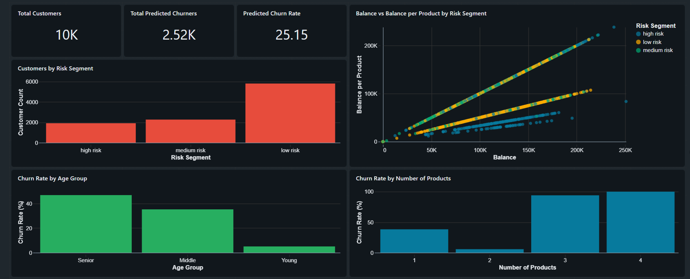
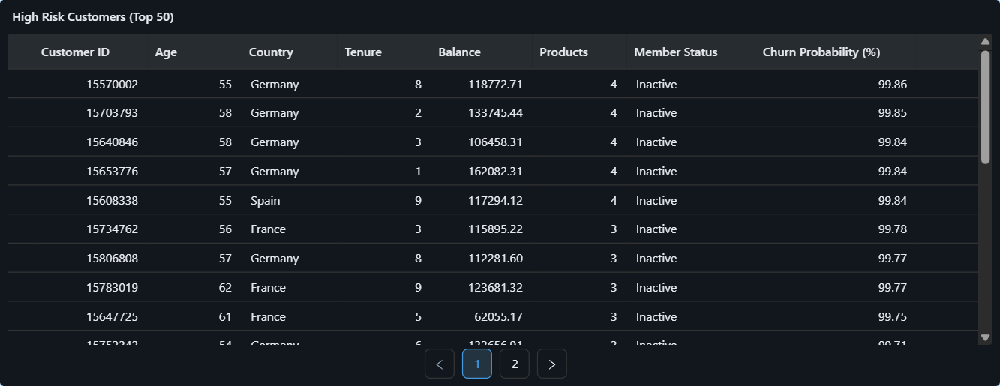
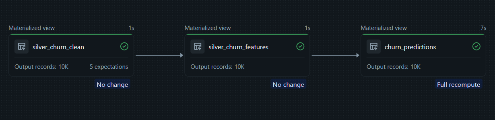
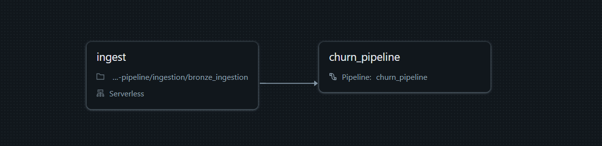

# Bank Customer Churn Prediction Pipeline

An end-to-end data engineering and machine learning project built on Databricks (Free Tier) that predicts which bank customers are likely to churn, segments them by risk level, and surfaces actionable insights through a live dashboard - updated daily through an automated pipeline.

---

## Dashboard



**25.15% predicted churn rate** across 10,000 customers. Seniors churn at nearly 47%. Customers with 3+ products show extreme churn rates — 94% for 3 products, 100% for 4. High-balance customers concentrated in few products cluster overwhelmingly in the high risk segment. The 1,912 high risk customers represent the immediate intervention priority.

---

## High Risk Customers



The pipeline surfaces the top customers by churn probability, enriched with balance, tenure, country, and activity status — ready for a retention team to act on without further analysis.

---

## Architecture

The project follows the **medallion architecture** on Databricks, with a machine learning stage trained in Google Colab and model weights stored in a Databricks Volume as the handoff point between training and daily inference.

```
Supabase PostgreSQL (bank_customers table)
        ↓  incremental JDBC ingestion (daily job)
Bronze — bronze_churn_raw
        ↓  DLT pipeline
Silver — silver_churn_clean → silver_churn_features
        ↓  DLT pipeline (inference UDF loads model from Volume)
Gold   — churn_predictions (live DLT table)
        ↓
Databricks Dashboard
```

---

## Pipeline Graph



The DLT pipeline manages the full Bronze → Silver → Gold transformation in a single run, resolving table dependencies automatically from `dlt.read()` calls across both scripts.

---

## Job Orchestration



The `churn_daily_job` runs on a daily schedule with two tasks:

- **Task 1 — ingest**: notebook task connecting to Supabase via JDBC, incrementally reading new customer rows using a `created_at` watermark and appending to `bronze_churn_raw`
- **Task 2 — churn_pipeline**: DLT pipeline task that runs after Task 1 completes, executing the full Silver and Gold transformation including model inference

---

## Repository Structure

```
churn-pipeline/
├── ingestion/
│   └── bronze_ingest.py              # Incremental JDBC ingestion from Supabase
├── transformations/
│   ├── bronze_to_silver.py           # DLT: cleaning + feature engineering
│   └── silver_to_gold.py             # DLT: inference UDF + risk segmentation
├── ml/
│   ├── export_features.py            # Exports Silver parquet to Volume for Colab
│   └── ML_Notebook.ipynb             # Google Colab: train XGBoost, log to MLflow
├── jobs/
│   └── churn_daily_job.yml           # Databricks job orchestration config
├── pipelines/
│   └── churn_pipeline.json           # DLT pipeline config
└── screenshots/
    ├── dashboard.png
    ├── HRC_table.png
    ├── churn_pipeline.png
    └── churn_daily_job.png
```

---

## Data Source

Customer data is stored in **Supabase (PostgreSQL)** and ingested incrementally into Databricks using JDBC with a watermark on `created_at`. The Kaggle bank churn dataset was used to populate the initial Supabase table, with new rows simulating arriving customers over time.

| Column | Description |
|---|---|
| `customer_id` | Unique customer identifier |
| `credit_score` | Customer credit score (300–850) |
| `country` | Germany, France, or Spain |
| `gender` | Male or Female |
| `age` | Customer age |
| `tenure` | Years as a customer |
| `balance` | Account balance |
| `products_number` | Number of bank products held |
| `credit_card` | Has credit card (1/0) |
| `active_member` | Is active member (1/0) |
| `estimated_salary` | Estimated annual salary |
| `churn` | Actual churn label (1 = churned) |

---

## Pipeline Stages

### Bronze — Raw Ingestion
`bronze_ingest.py` connects to Supabase via JDBC using a `created_at` watermark. On the first run it ingests all rows. On subsequent daily runs it appends only new records, keeping the Bronze table as a full historical log.

### Silver — Cleaning and Feature Engineering
A DLT pipeline running `bronze_to_silver.py` produces two tables:

**`silver_churn_clean`** — applies DLT data quality expectations (valid credit score range, age range, valid churn label) and casts all columns to correct types.

**`silver_churn_features`** — engineers predictive features:

| Feature | Description |
|---|---|
| `is_germany`, `is_spain` | One-hot encoded geography (France is baseline) |
| `is_male` | Binary encoded gender |
| `is_zero_balance` | 1 if balance is zero |
| `balance_per_product` | Balance divided by number of products |
| `is_inactive_with_balance` | 1 if inactive member with positive balance |
| `tenure_ratio` | Tenure divided by age |
| `is_young`, `is_senior` | Age group encoding (middle is baseline) |

### Gold — Inference and Risk Segmentation
`silver_to_gold.py` loads the trained XGBoost model from the Databricks Volume using a Pandas UDF, runs predictions on `silver_churn_features`, and writes `churn_predictions` with:

- `churn_probability` — model output probability (0–1)
- `churned_predicted` — binary prediction at 0.5 threshold
- `churn_risk_segment` — low risk (< 0.3), medium risk (0.3–0.6), high risk (> 0.6)
- `prediction_date` — timestamp of the prediction run

---

## Machine Learning

The model is trained outside the daily pipeline in **Google Colab (T4 GPU)** and uploaded back to the Databricks Volume. The daily DLT pipeline loads the model weights at inference time — no retraining on each run.

| Component | Detail |
|---|---|
| Model | XGBoost classifier |
| Class imbalance handling | `scale_pos_weight` (~4) |
| Train/val split | 80/20 stratified |
| Accuracy | 83% |
| F1 score (churned class) | 0.64 |
| Experiment tracking | MLflow → Databricks workspace |

**Top 5 features by importance:**

| Feature | Importance |
|---|---|
| `products_number` | 0.177 |
| `age` | 0.152 |
| `active_member` | 0.135 |
| `is_zero_balance` | 0.118 |
| `is_inactive_with_balance` | 0.106 |

---

## Key Insights

- Customers with **3 products churn at 94%** and **4 products at 100%** — cross-selling beyond 2 products is strongly counterproductive to retention
- **Senior customers (55+) churn at 47%** — nearly nine times the rate of young customers
- **Inactive members with positive balances** are a key at-risk segment, captured by the `is_inactive_with_balance` feature
- The scatter plot confirms that high risk customers concentrate along the high `balance_per_product` diagonal — balance concentration in few products is a stronger signal than raw balance alone

---

## Tech Stack

| Component | Technology |
|---|---|
| Data platform | Databricks Free Tier (Serverless) |
| Storage | Delta Lake, Databricks Volumes |
| Ingestion | JDBC incremental (watermark) |
| Transformation | Delta Live Tables, PySpark |
| ML training | Google Colab (T4 GPU), XGBoost |
| ML tracking | MLflow (Databricks-hosted) |
| Orchestration | Databricks Workflows (daily schedule) |
| Source database | Supabase (PostgreSQL) |
| Version control | GitHub + Databricks Git Folders |

---

## How to Run

### Prerequisites
- Databricks Free Tier workspace with Unity Catalog enabled
- Supabase project with a `bank_customers` table containing a `created_at` timestamp column
- Google Colab account (free tier with T4 GPU runtime)

### Steps

1. Create Volume `main.default.churn_vol` with folders `exports/` and `models/`
2. Create schemas `workspace.bronze`, `workspace.silver`, `workspace.gold`
3. Connect this repo as a Git folder in your Databricks workspace
4. Update the Supabase credentials in `bronze_ingest.py`
5. Create the DLT pipeline pointing at `bronze_to_silver.py` and `silver_to_gold.py`
6. Run `bronze_ingest.py` manually to populate `bronze_churn_raw`
7. Run the DLT pipeline to populate Silver tables
8. Run `export_features.py` to export Parquet files to the Volume
9. Download the Parquet files and run `ML_Notebook.ipynb` in Google Colab
10. Confirm model artifacts are uploaded to `churn_vol/models/`
11. Re-run the DLT pipeline — `churn_predictions` will now include predictions
12. Create `churn_daily_job` in Workflows using the config in `jobs/churn_daily_job.yml`
13. Schedule the job daily and run once manually to confirm end-to-end flow

---

## Retraining the Model

The model is not retrained on every pipeline run. To retrain:

1. Run `export_features.py` manually in Databricks to refresh the Parquet export
2. Download the updated Parquet files and re-run `ML_Notebook.ipynb` in Colab
3. The notebook uploads new model weights to the Volume automatically
4. The next daily job run picks up the new weights without any pipeline changes
